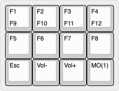
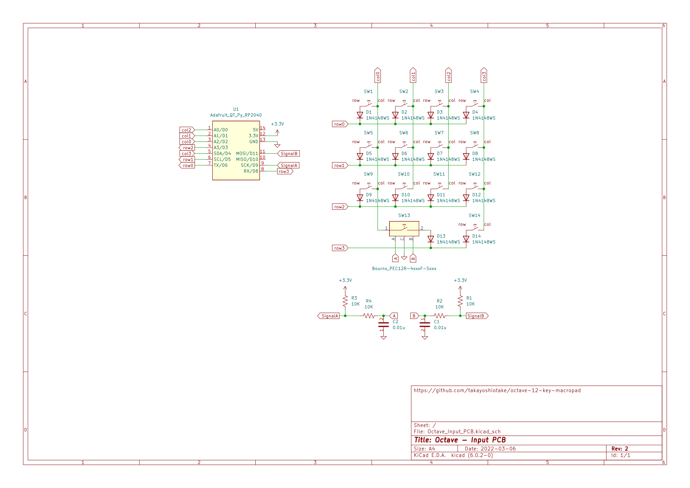
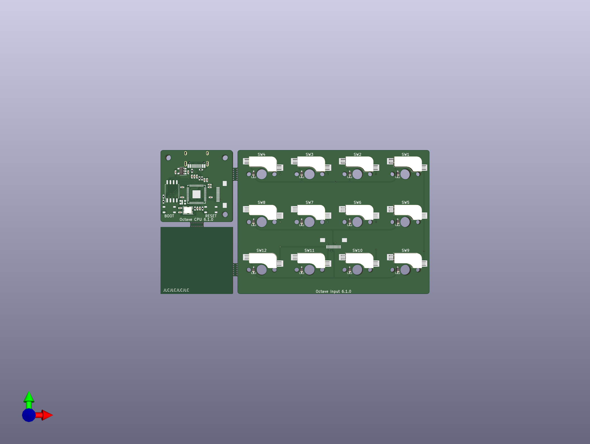

# Octave

The Octave is a 12-key macropad.
It is primarily designed to be a compact keyboard with support for 12 function keys (F1 - F12).

## Status

- [ ] Second prototype: Custom MCU board
- [x] First prototype

## Specifications

- USB-C (USB2.0, HID)
- Hot-swap sockets for MX compatible switches
- Incremental encoder with push momentary switch
- Programmable firmware (CircuitPython)
- No LEDs
- No keycaps
- No switches

## Layout



- 12 function keys (F1 - F12)
- 1 momentary layer key (MO)
- 1 incremental encoder (Knob)

It is important that there are four rows.
Just like the function keys on many keyboards are divided into four rows each. It is also important that it is easy to operate with one hand.

Designed to be used with the left hand.
In particular, the MO key is placed so that it can be pressed with the thumb.

**RAW data for Keyboard Layout Editor v0.15:**

📄 [layout/keyboard-layout.rawdata.json](layout/keyboard-layout.rawdata.json)

```js
["F1","F2","F3","F4"],
["F5","F6","F7","F8"],
["F9","F10","F11","F12"],
["Knob",{x:2},"MO"],
```

- 🔗 [Keyboard Layout Editor](http://www.keyboard-layout-editor.com/)

## Schematic

📄 [electronics/Octave_Input_PCB.svg](electronics/Octave_Input_PCB.svg) (rev.3)


Since USB VIDs and PIDs are not readily available to individuals, I decided to use the Adafruit QT Py RP2040 as is, which provides CircuitPython with built-in VID and PID.

Also, most importantly, I have never designed an MCU circuit before, so to avoid risk, I will forgo a custom MCU PCB for this project.

- MCU: Adafruit QT Py RP2040
  - 🔗 <https://learn.adafruit.com/adafruit-qt-py-2040>

📄 [electronics/Octave_Input_PCB/Octave_Input_PCB.kicad_sch](electronics/Octave_Input_PCB/Octave_Input_PCB.kicad_sch)

## PCB

📄 [electronics/Octave_Input_PCB_3D.png](electronics/Octave_Input_PCB_3D.png) (rev.2.1)


📄 [electronics/Octave_Input_PCB/Octave_Input_PCB.kicad_pcb](electronics/Octave_Input_PCB/Octave_Input_PCB.kicad_pcb)

## BOM

[[Closed] Prototype - First](prototype/README.md)
