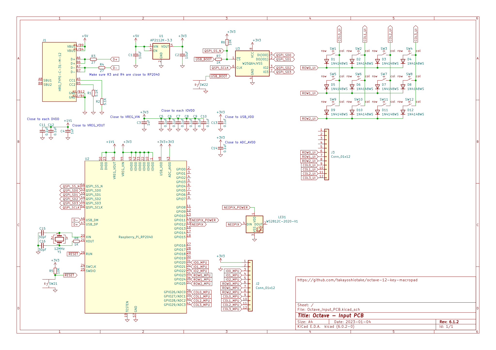
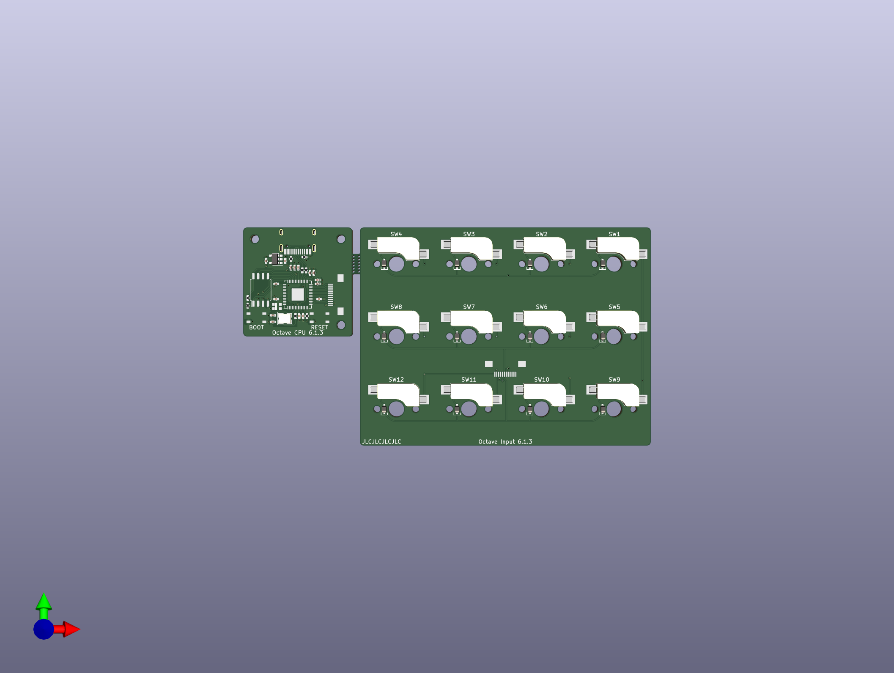

# Octave

The Octave is a 12-key macropad.
It is primarily designed to be a compact keyboard with support for 12 function keys (F1 - F12).

## Status

- [ ] prototype-2: Custom MCU board
  - [ ] Consideration
  - [x] Test
  - [x] PCB
- [x] prototype-1

## Specifications

- USB-C (USB2.0, HID)
- Hot-swap sockets for MX compatible switches
- Incremental encoder with push momentary switch
- Stick controller with push momentary switch
- Programmable firmware (CircuitPython)
- No LEDs
- No keycaps
- No switches

## Layout

📄 [layout/keyboard-layout.png](layout/keyboard-layout.png) (rev.2)


- 12 function keys (F1 - F12)
- 1 momentary layer key (MO)
- 1 incremental encoder (Knob)
- 1 stick controller (Stick)

It is important that there are four rows.
Just like the function keys on many keyboards are divided into four rows each. It is also important that it is easy to operate with one hand.

It is designed to be used with the left hand.
In particular, the incremental encoder and stick controller are placed in easy-to-operate positions.

**RAW data for Keyboard Layout Editor v0.15:**

📄 [layout/keyboard-layout.rawdata.json](layout/keyboard-layout.rawdata.json)

```js
["F1","F2","F3","F4"],
["F5","F6","F7","F8"],
["F9","F10","F11","F12"],
["MO",{x:2,c:"#c8b273"},"Knob"],
[{y:-0.5,x:1.5,c:"#666666",t:"#cccccc"},"Stick"],
```

- 🔗 [Keyboard Layout Editor](http://www.keyboard-layout-editor.com/)

## Schematic

📄 [electronics/Octave_Input_PCB.svg](electronics/Octave_Input_PCB.svg) (rev.5.0.2)



I have also designed a custom MCU circuit from prototype-2, the MCU is RP2040 and the software runs on CircuitPython built specifically for it.

📄 [electronics/Octave_Input_PCB/Octave_Input_PCB.kicad_sch](electronics/Octave_Input_PCB/Octave_Input_PCB.kicad_sch)

## PCB

📄 [electronics/Octave_Input_PCB_3D.png](electronics/Octave_Input_PCB_3D.png) (rev.5.0.2)



📄 [electronics/Octave_Input_PCB/Octave_Input_PCB.kicad_pcb](electronics/Octave_Input_PCB/Octave_Input_PCB.kicad_pcb)

## CircuitPython

Software for the Octave (prototype-2) runs on CircuitPython.
You can fetch the CircuitPython source code for the Octave from the following GitHub repo.

**Stable:**

- 🔗 [takayoshiotake/circuitpython:7.3.x-board-octave-rp2040](https://github.com/takayoshiotake/circuitpython/tree/7.3.x-board-octave-rp2040)
  - <https://github.com/takayoshiotake/circuitpython/tree/c3b4d05dc04d74c6229506215eae799fb23f37ce/ports/raspberrypi/boards/takayoshiotake_octave_rp2040>

**Latest:**

- 🔗 [adafruit/circuitpython](https://github.com/adafruit/circuitpython)
  - <https://github.com/adafruit/circuitpython/tree/main/ports/raspberrypi/boards/takayoshiotake_octave_rp2040>
- 🔗 [Built UF2](https://adafruit-circuit-python.s3.amazonaws.com/index.html?prefix=bin/takayoshiotake_octave_rp2040/)

## BOM & Software

- [[WIP] prototype-2](prototype-2/README.md)

### History

- [[Closed] prototype-1](prototype-1/README.md)
