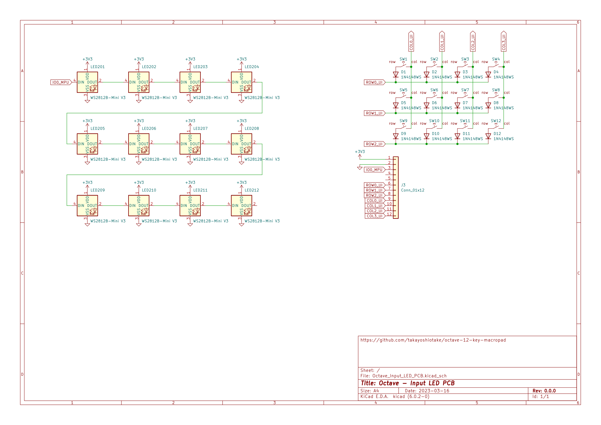

# Octave

The Octave is a 12-key macropad.
It is primarily designed to be a compact keyboard with support for 12 function keys (F1 - F12).

## Status

  

- [ ] prototype-3.1: Upgrade with LEDs under keys
  - [ ] LED Animation
  - [x] PCB: OK!
- [x] prototype-3: Simple design
  - [x] Enclosure: OK!
  - [x] Test: OK!
  - [x] PCB: OK!
- [x] prototype-2: Custom MCU board
  - [x] Consideration
  - [x] Test
  - [x] PCB
- [x] prototype-1

## Specifications

- USB-C (USB2.0, HID)
  - 🔗 <https://pid.codes/1209/8CAE/>
- Hot-swap sockets for MX compatible switches
- Programmable firmware (CircuitPython)

## Layout

📄 [layout/keyboard-layout.png](layout/keyboard-layout.png) (rev.5)


- 12 function keys (F1 - F12)

**RAW data for Keyboard Layout Editor v0.15:**

📄 [layout/keyboard-layout.rawdata.json](layout/keyboard-layout.rawdata.json)

```json
[{f:3},"F1\nF9","F2\nF10","F3\nF11","F4\nF12"],
["F5\nVol-","F6\nVol+","F7\nRW","F8\nFF"],
["Shift","Ctrl","Esc","MO(1)"]
```

- 🔗 [Keyboard Layout Editor](http://www.keyboard-layout-editor.com/)

## Schematic

📄 [electronics/Octave_Input_PCB.svg](electronics/Octave_Input_PCB.svg) (rev.6.1.2)


I have also designed a custom MCU circuit from prototype-2, the MCU is RP2040 and the software runs on CircuitPython built specifically for it.

📄 [electronics/Octave_Input_PCB/Octave_Input_PCB.kicad_sch](electronics/Octave_Input_PCB/Octave_Input_PCB.kicad_sch)

### Upgrade schematic with LEDs under keys

📄 [electronics/Octave_Input_LED_PCB.svg](electronics/Octave_Input_LED_PCB.svg) (rev.1.0.0)



📄 [electronics/Octave_Input_PCB/Octave_Input_LED_PCB.kicad_sch](electronics/Octave_Input_PCB/Octave_Input_LED_PCB.kicad_sch)

## PCB

📄 [electronics/Octave_Input_PCB_3D.png](electronics/Octave_Input_PCB_3D.png) (rev.6.1.3)


📄 [electronics/Octave_Input_PCB/Octave_Input_PCB.kicad_pcb](electronics/Octave_Input_PCB/Octave_Input_PCB.kicad_pcb)

### Upgrade PCB with LEDs under keys

📄 [electronics/Octave_Input_LED_PCB_3D.png](electronics/Octave_Input_LED_PCB_3D.png) (rev.1.0.0)


📄 [electronics/Octave_Input_LED_PCB/Octave_Input_LED_PCB.kicad_pcb](electronics/Octave_Input_LED_PCB/Octave_Input_LED_PCB.kicad_pcb)

## CircuitPython

Software for the Octave (prototype-2, prototype-3) runs on CircuitPython.

**Latest:**

- 🔗 [adafruit/circuitpython](https://github.com/adafruit/circuitpython)
  - 🔗 <https://github.com/adafruit/circuitpython/tree/main/ports/raspberrypi/boards/takayoshiotake_octave_rp2040>
- 🔗 [Built UF2](https://adafruit-circuit-python.s3.amazonaws.com/index.html?prefix=bin/takayoshiotake_octave_rp2040/)

**Older:**

- 🔗 [takayoshiotake/circuitpython:7.3.x-board-octave-rp2040](https://github.com/takayoshiotake/circuitpython/tree/7.3.x-board-octave-rp2040)
  - 🔗 <https://github.com/takayoshiotake/circuitpython/tree/c3b4d05dc04d74c6229506215eae799fb23f37ce/ports/raspberrypi/boards/takayoshiotake_octave_rp2040>

- How to build:
  - 🔗 <https://learn.adafruit.com/building-circuitpython/build-circuitpython>
  - 🔗 <https://github.com/takayoshiotake/circuitpython/blob/c3b4d05dc04d74c6229506215eae799fb23f37ce/BUILDING.md>

## Plate

📄 [mechanics/Octave_Plate_3D.png](mechanics/Octave_Plate_3D.png) (rev.1.0.3)


📄 [mechanics/Octave_Plate/Octave_Plate.kicad_pcb](mechanics/Octave_Plate/Octave_Plate.kicad_pcb)

## Enclosure

- 📄 [mechanics/Octave_Enclosure-Case.stl](mechanics/Octave_Enclosure-Case.stl) (rev.1.0.0)
- 📄 [mechanics/Octave_Enclosure-Top Frame.stl](mechanics/Octave_Enclosure-Top%20Frame.stl) (rev.1.0.0)

## BOM & Software

🏷 [prototype-3-pcb](https://github.com/takayoshiotake/octave-12-key-macropad/releases/tag/prototype-3-pcb)

| Material | Unit | Designator | Note | JLCPCB Part # |
|-|-:|-|-|-|
| Octave CPU PCB rev.6.1.3 | 1 | n/a | JLCPCB |
| Octave Input PCB rev.6.1.3 *[2]* | 1 | n/a | JLCPCB |
| Octave Plate rev.1.0.3 | 1 | n/a | JLCPCB, Alminium PCB (t=1.6mm) |
| 0151660120 | 1 | n/a | Molex 0.50mm pitch FFC, Type D, 50.80mm, 12 circuits |
| CPG151101S11-2 | 12 | SW1-12 *[2]* | Kailh®︎ hot swap socket (White) |
||
| Octave Enclosure Case rev.1.0.0 | 1 | n/a | JLCPCB, 3D printing (MJF), PA12-HP Nylon |
| Octave Enclosure Top Frame rev.1.0.0 | 1 | n/a | JLCPCB, 3D printing (MJF), PA12-HP Nylon |
| PORON | 4 | n/a | 78mm x 2.5mm (t=1.5mm) |
| PORON | 4 | n/a | 59mm x 2.5mm (t=1.5mm) |
| Screw M2 5mm | 1 | n/a | Hirosugi B-0205 |
| Screw M2 8mm | 4 | n/a | Hirosugi B-0208 |
| Insert nut M2 | 4 | n/a | Hirosugi HSB-203030Z |
| Nut M2 | 1 | n/a | Hirosugi BNT-02-2 |
| Washer M2 | 1 | n/a | Hirosugi BW-0243-03 |
||
| 30pF 0402 | 2 | C15, C16 | PCBA | C1570 |
| 100nF 0402 | 10 | C5-14 | PCBA | C307331 |
| 1uF 0402 | 2 | C3, C4 | PCBA | C52923 |
| 10uF 0402 | 2 | C1, C2 | PCBA | C15525 |
| 1N4148WS | 12 | D1-12 *[2]* | PCBA | C2128 |
| HRO_TYPE-C-31-M-12 | 1 | J1 | PCBA, USB Connector (Type-C) | C165948 |
| JUSHUO_AFC01-S12FCC-00 | 2 | J2, J3 *[2]* | PCBA, FFC Connector (0.50mm pitch, 12 circuits) | C262268 |
| 27Ω 0402 | 2 | R3, R4 | PCBA | C352446 |
| 1KΩ 0402 | 2 | R7, R8 | PCBA | C11702 |
| 5.1KΩ 0402 | 2 | R1, R2 | PCBA | C25905 |
| 10KΩ 0402 | 2 | R5, R6 | PCBA | C25744 |
| AP2112K-3.3 | 1 | U1 | PCBA | C51118 |
| Raspberry Pi RP2040 | 1 | U2 | PCBA | C2040 |
| W25Q64JVSSIQ | 1 | U3 | PCBA | C179171 |
| 12MHz Crystal Resonator SMD-3225 | 1 | Y1 | PCBA, YSX221SL | C9002 |
| SKRPANE010 | 2 | SW21, SW22 | PCBA, Alps Alpine tactile switch | C470426 |
||
| WS2812C-2020-V1 | 1 | LED1 *[1]* | PCBA, NeoPixel | C2976072 |

MEMO: *[1]* To reduce costs, I did not assemble LED1 with PCBA.
MEMO: *[2]* Can be replaced with upgrade parts.

Upgrade parts:

| Material | Unit | Designator | Note | JLCPCB Part # |
|-|-:|-|-|-|
| Octave Input LED PCB rev.1.0.0 | 1 | n/a | JLCPCB |
| CPG151101S11-2 | 12 | SW1-12 | Kailh®︎ hot swap socket (White) |
||
| 1N4148WS | 12 | D1-12 | PCBA | C2128 |
| JUSHUO_AFC01-S12FCC-00 | 1 | J3 | PCBA, FFC Connector (0.50mm pitch, 12 circuits) | C262268 |
||
| WS2812B-Mini-V3 | 12 | LED201-0212 | NeoPixel |

- Octave CPU PCB rev.6.1.3, Octave Input PCB rev.6.1.3 (PCBA)

     

- Octave Input LED PCB rev.1.0.0 (Upgrade)

    

- Octave Plate rev.1.0.3

     

- Assembly

    
    
    

### Software

- [Software](software/README.md)

### History

- [[Closed] prototype-2](prototype-2/README.md)
- [[Closed] prototype-1](prototype-1/README.md)
