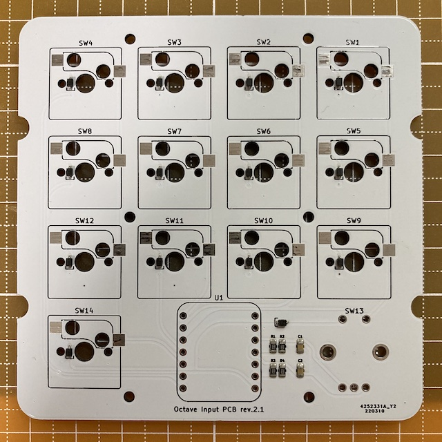
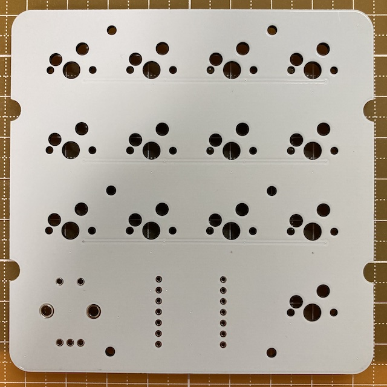
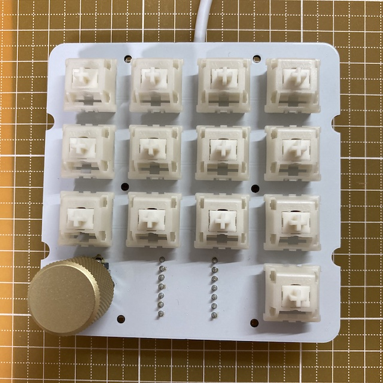
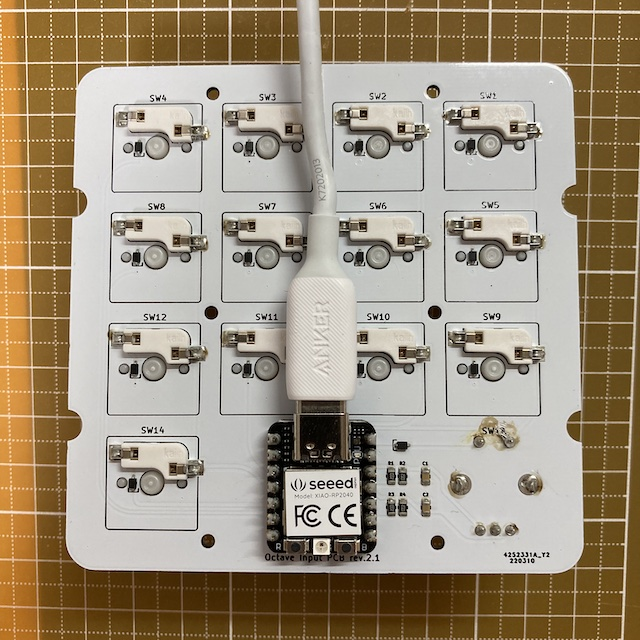
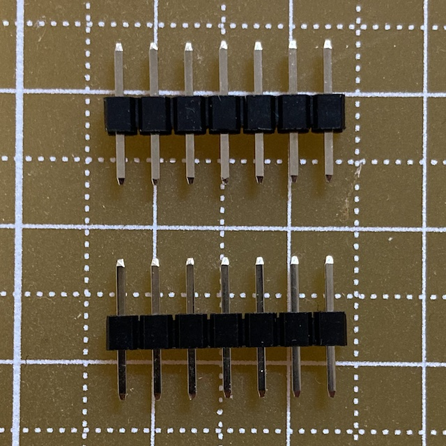
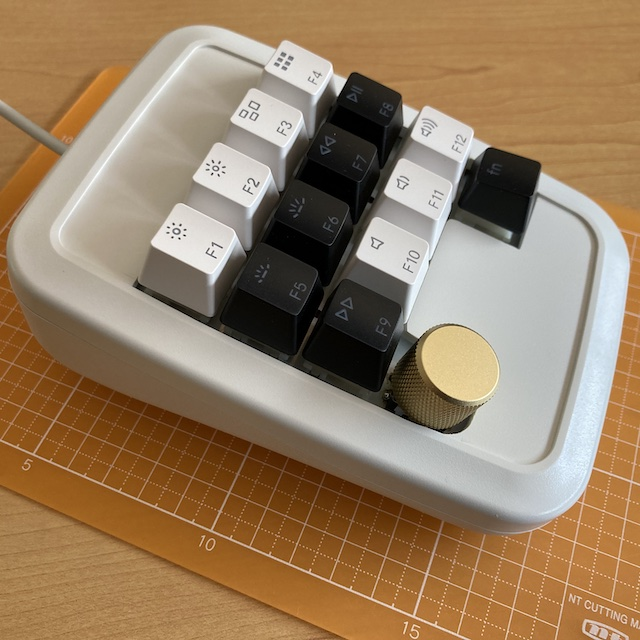
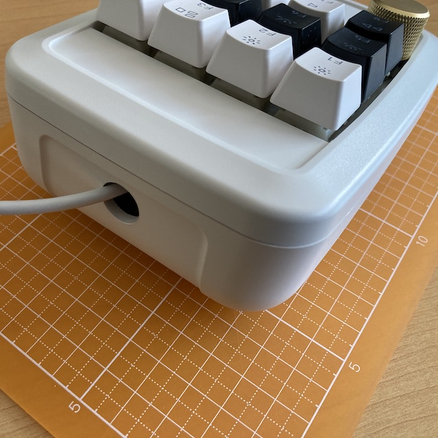
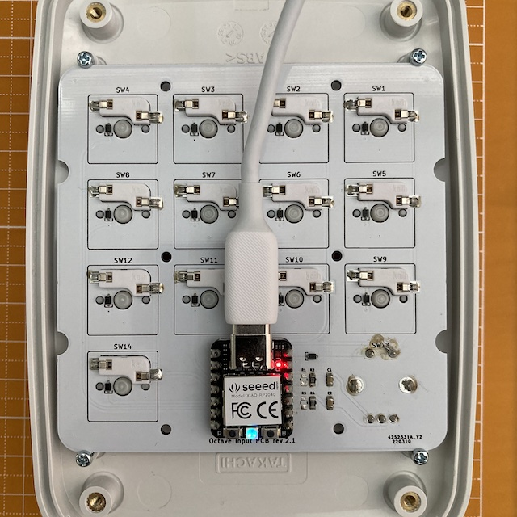

# Prototype

## [Closed] First

### BOM

**PCB:**

| Material | Unit | Designator | Note |
|-|-:|-|-|
| Octave Input PCB rev.2.1 | 1 | n/a | JLCPCB |
| 0.01uF 0805(2012 Metric) | 2 | C1,C2 | PCBA |
| 1N4148WS | 14 | D1-14 | PCBA |
| 10KΩ 0805(2012 Metric) | 4 | R1-4 | PCBA |
| XIAO RP2040 | 1 | U1 | Seeed |
| 1x7-pin header | 2 | U1 | included with XIAO RP2040 |
| CPG151101S11-2 | 13 | SW1-12, SW14 | Kailh®︎ hot swap socket |
| PEC12R-4217F-S0024-ND | 1 | SW13 | Bourns incremental encoder |
| Boba U4 (68g) | 13 | (SW1-12, SW14) | Gazzew silent tactile keyboard switch |
| GLO-ACC-P75-RK-G | 1 | (SW13) | Glorious rotary knob for GMMK Pro (Gold) |

**Enclosure:**

| Material | Unit | Note |
|-|-:|-|
| WSC10-14-5W | 1 | TAKACHI Sloped plastic enclosure |
| M2.3 x6mm self-tapping screw  | 4 |  |

- Octave Input PCB rev.2.1

     

- Octave Input PCB rev.2.1 (Assembled)

     

- 1x7-pin header (adjusted length)

    

- Enclosure

      

## Software

- 📄 [software/README.md](software/README.md)

### Issues

- [x] Some pin names in U1 of schematic rev.2 are incorrect (D8-11 --> D7-10)
    ↪︎ Fixed in rev.3
- [x] Pay attention to the mounting surface of SW13
    ↪︎ I'll be very careful next time...
- [x] The XIAO RP2040's POWER LED (RED) cannot be turned off because it cannot be controlled.
    ↪︎ no problem
- [x] Fatal: Rotation cannot be detected because SingalA and SignalB do not go to Low level due to the value of R1-R4 in the schematic rev.2.
    ↪︎ It can be solved by removing R1 and R3 and using pull-up of RP2040 instead, or use a large value such as 100K for R1 and R3.
    ↪︎ Fixed in rev.3

The following issues are carried over to the next prototype.

- In PCB rev.2.1, col0 will not work if the through hole of pin1 of SW13 fails.
    ↪︎ Improve routing
- The push switch of PEC12R-4217F-S0024-ND is clicky and heavy and loud.
- A specially designed enclosure is required.
    ↪︎ U1 takes up a lot of space.
    ↪︎ The only way seems to be to design a dedicated MCU circuit.

### Results

The combination of PEC12R-4217F-S0024-ND and GLO-ACC-P75-RK-G fits perfectly.
However, although the PEC12R-4217F-S0024-ND is great as a rotary encoder, it has a heavy click feeling and a loud sound, so I would like to find an alternative.

I think the most important issue is that the USB cable must be connected inside the enclosure.
It seems necessary to design the MCU circuit in the next prototype.
