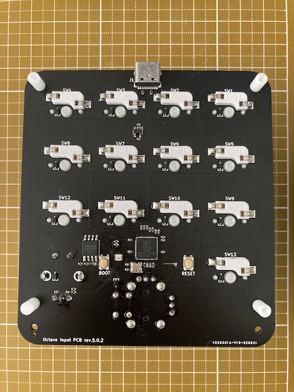

# prototype-2

 

## BOM

**PCB:**

🏷 [prototype-2-pcb](https://github.com/takayoshiotake/octave-12-key-macropad/releases/tag/prototype-2-pcb)

| Material | Unit | Designator | Note | JLCPCB Part # |
|-|-:|-|-|-|
| Octave Input PCB rev.5.0.2 | 1 | n/a | JLCPCB |
| 30pF 0402 | 2 | C15, C16 | PCBA | C1570 |
| 10nF 0402 | 2 | C21, C22 | PCBA | C15195 |
| 100nF 0402 | 10 | C5-14 | PCBA | C307331 |
| 1uF 0402 | 4 | C1-4 | PCBA | C52923 |
| 1N4148WS | 15 | D1-15 | PCBA | C2128 |
| HRO_TYPE-C-31-M-12 | 1 | J1 | PCBA, USB Connector (Type-C) | C165948 |
| WS2812C-2020-V1 | 1 | LED1 | PCBA, NeoPixel | C2976072 |
| 27Ω 0402 | 2 | R3, R4 | PCBA | C352446 |
| 1KΩ 0402 | 2 | R7, R8 | PCBA | C11702 |
| 5.1KΩ 0402 | 2 | R1, R2 | PCBA | C25905 |
| 10KΩ 0402 | 4 | R5, R6, R12, R14 | PCBA | C25744 |
| 100KΩ 0402 | 2 | R11, R13 | PCBA | C25086 |
| AP2112K-3.3 | 1 | U1 | PCBA | C51118 |
| Raspberry Pi RP2040 | 1 | U2 | PCBA | C2040 |
| W25Q64JVSSIQ | 1 | U3 | PCBA | C179171 |
| 12MHz Crystal Resonator SMD-3225 | 1 | Y1 | PCBA, YSX221SL | C9002 |
| CPG151101S11-2 | 13 | SW1-13 | Kailh®︎ hot swap socket (White) |
| RKJXV122400R | 1 | SW14 | Alps Alpine stick controller |
| PEC12R-4217F-S0024-ND | 1 | SW15 | Bourns incremental encoder |
| SKRPANE010 | 1 | SW21, SW22 | PCBA, Alps Alpine tactile switch | C470426 |

## CircuitPython

Software for the Octave (prototype-2) runs on CircuitPython.
You can fetch the CircuitPython source code for the Octave from the following GitHub repo.

**Stable:**

- 🔗 [takayoshiotake/circuitpython:7.3.x-board-octave-rp2040](https://github.com/takayoshiotake/circuitpython/tree/7.3.x-board-octave-rp2040)
  - <https://github.com/takayoshiotake/circuitpython/tree/c3b4d05dc04d74c6229506215eae799fb23f37ce/ports/raspberrypi/boards/takayoshiotake_octave_rp2040>

**Latest:**

- 🔗 [adafruit/circuitpython](https://github.com/adafruit/circuitpython)
  - <https://github.com/adafruit/circuitpython/tree/main/ports/raspberrypi/boards/takayoshiotake_octave_rp2040>
- 🔗 [Built UF2](https://adafruit-circuit-python.s3.amazonaws.com/index.html?prefix=bin/takayoshiotake_octave_rp2040/)

## Software

🏷 [9bc4500: https://github.com/takayoshiotake/octave-12-key-macropad/tree/40bdf7dd3696c3ced7790cf87acc5dc2551b9874/software](https://github.com/takayoshiotake/octave-12-key-macropad/tree/40bdf7dd3696c3ced7790cf87acc5dc2551b9874/software)

## Issues

- [x] Fatal: SW21 and SW22 do not work.
  ↪︎ BOOT, RESET works when manually shorted to GND by wire.
  ↪︎ Fixed schematics and PCB in rev.5.0.3
- [x] Fatal: Rotation cannot be detected because SingalA and SignalB do not go to Low level due to the value of R11, R13 in the schematic rev.5.0.2.
  ↪︎ It can be solved by removing R1 and R3 and using pull-up of RP2040 instead, or use a **small** value such as 1K for R11 and R13.
  ↪︎ Fixed schematics and PCB in rev.5.0.4
- [x] The incremental encoder and stick controller are difficult to operate with this placement on the PCB.
  ↪︎ These input devices are not considered important and will be removed in the next version. It should be simple.
- [x] Custom MCU boards are expensive to manufacture and require a lot of work, including the need for USB VID/PID. Also, the board is larger due to the USB-C connector.
  ↪︎ It seems that it would be better to separate the IO board from the MCU board. However, if they are connected with pin headers, it will be difficult to design a housing as in Prototype 1, so I think it is better to connect them with cables.
  ↪︎ Considered in next prototype.

## Results

Remove the incremental encoders and stick controller.
And for the next prototype, I will consider whether to divide the PCB into an MCU board and an IO board, and whether to adopt a custom MCU board.
