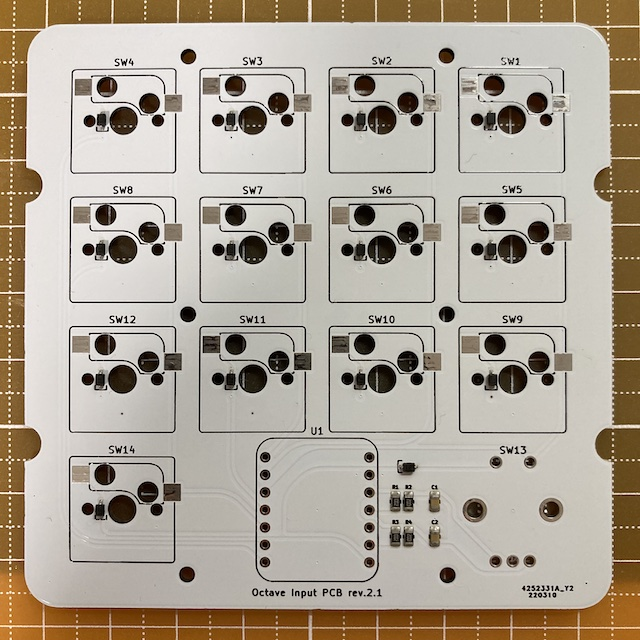
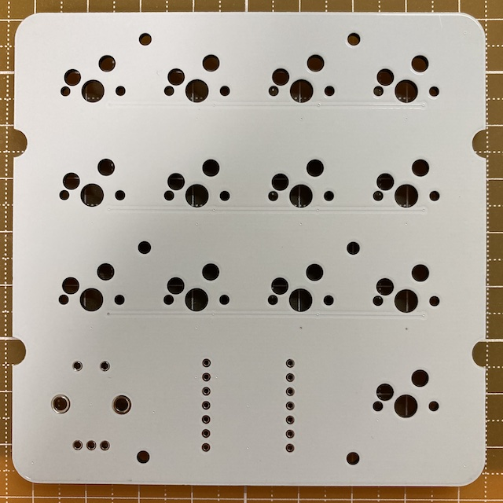
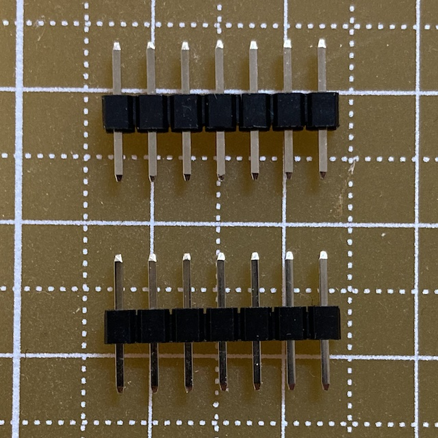

# Prototype

## First

### BOM

| Material | Unit | Designator | Note |
|-|-:| -|-|
| Octave Input PCB rev.2.1 | 1 | n/a | JLCPCB |
| 0.01uF 0805(2012 Metric) | 2 | C1,C2 | PCBA |
| 1N4148WS | 14 | D1-14 | PCBA |
| 10KΩ 0805(2012 Metric) | 4 | R1-4 | PCBA |
| XIAO RP2040 | 1 | U1 | Seeed |
| 1x7-pin header | 2 | U1 | included with XIAO RP2040 |
| CPG151101S11-2 | 13 | SW1-12, SW14 | Kailh®︎ hot swap socket |
| PEC12R-4217F-S0024-ND | 1 | SW13 | Bourns incremental encoder |
| Boba U4 (68g) | 13 | (SW1-12, SW14) | Gazzew silent tactile keyboard switch |
| GLO-ACC-P75-RK-G | 1 | (SW13) | Glorious rotary knob for GMMK Pro (Gold) |

- Octave Input PCB rev.2.1

     

- 1x7-pin header (adjusted length)

    

- Software
  - 📄 [software_first/README.md](software_first/README.md)
