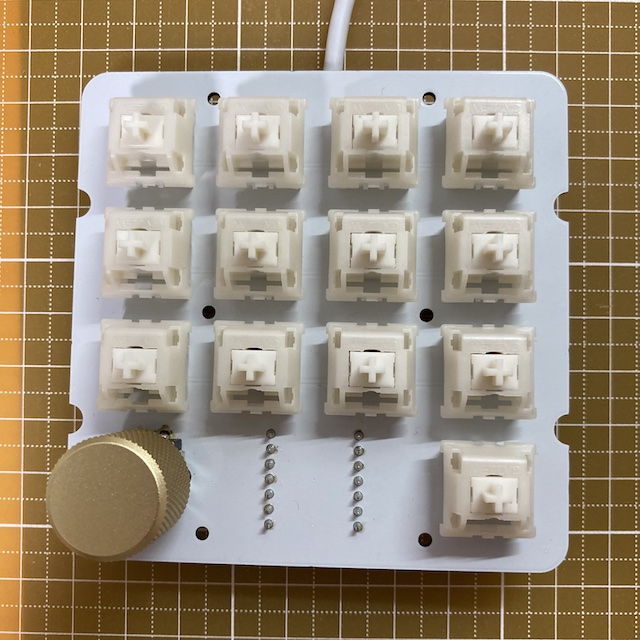
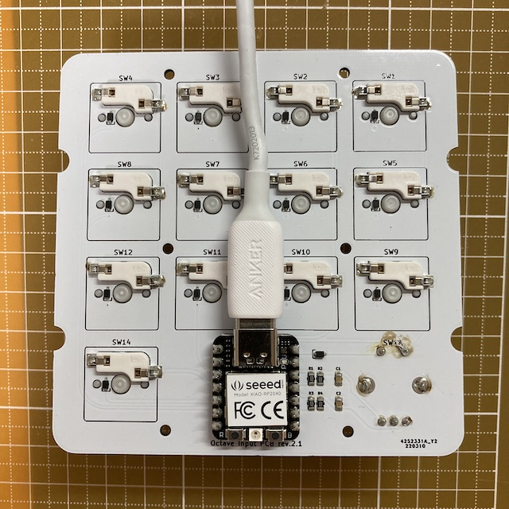

# Prototype

## First

### BOM

| Material | Unit | Designator | Note |
|-|-:| -|-|
| Octave Input PCB rev.2.1 | 1 | n/a | JLCPCB |
| 0.01uF 0805(2012 Metric) | 2 | C1,C2 | PCBA |
| 1N4148WS | 14 | D1-14 | PCBA |
| 10KΩ 0805(2012 Metric) | 4 | R1-4 | PCBA |
| XIAO RP2040 | 1 | U1 | Seeed |
| 1x7-pin header | 2 | U1 | included with XIAO RP2040 |
| CPG151101S11-2 | 13 | SW1-12, SW14 | Kailh®︎ hot swap socket |
| PEC12R-4217F-S0024-ND | 1 | SW13 | Bourns incremental encoder |
| Boba U4 (68g) | 13 | (SW1-12, SW14) | Gazzew silent tactile keyboard switch |
| GLO-ACC-P75-RK-G | 1 | (SW13) | Glorious rotary knob for GMMK Pro (Gold) |

- Octave Input PCB rev.2.1

     

- Octave Input PCB rev.2.1 (Assembled)

     

- 1x7-pin header (adjusted length)

    

- Software
  - 📄 [software_first/README.md](software_first/README.md)

### Issues

- [ ] Some pin names in U1 of schematic rev.2 are incorrect (D8-11 --> D7-10)
- [ ] Pay attention to the mounting surface of SW13
- [ ] In PCB rev.2.1, col0 will not work if the through hole of pin1 of SW13 fails.
- [ ] The XIAO RP2040's POWER LED (RED) cannot be turned off because it cannot be controlled.
- [ ] The push switch of PEC12R-4217F-S0024-ND is clicky and heavy and loud.
- [ ] Fatal: Rotation cannot be detected because SingalA and SignalB do not go to Low level due to the value of R1-R4 in the schematic rev.2.
    ↪︎ It can be solved by removing R1 and R3 and using pull-up of RP2040 instead, or use a large value such as 100K for R1 and R3.
