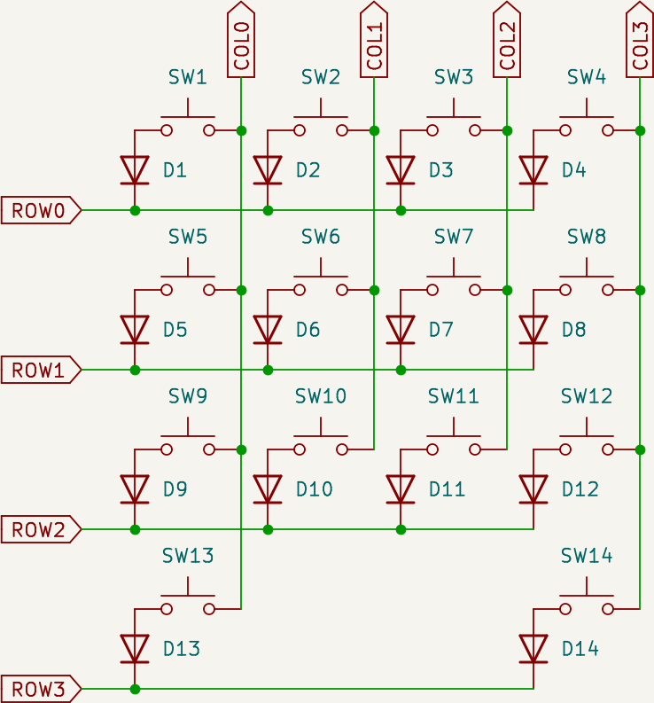

# key-matrix

This is an example of a 4x4 key matrix covering 14 keys. 8 GPIOs can be used to scan up to 16 switches.

Although omitted in the schematic, `COL0` to `COL3` are assumed to be connected to the pulled-up GPIO input pins, and `ROW0` to `ROW3` are assumed to be connected to the GPIO output pins.

To scan whether `SW1` to `SW4` are ON or OFF, set `ROW0` to Low and `ROW1` to `ROW3` to High, and read whether `COL0` to `COL3` are Low or High.

For example, when `SW2`, `SW3`, `SW7`, and `SW8` are pressed, `COL1` and `COL2` are set to Low, but `COL0` and `COL3` remains High.

In this case, current will flow from `COL1` and `COL2` to `ROW0`, but no current will flow between `COL2`, `COL3` and `ROW1` due to D7 and D8.

In this circuit, matrix scan is done row by row.
